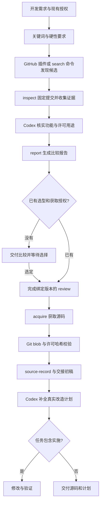

# 实现架构

## 定位

github-reuse-first 是“先评估复用，再开发”的 Codex Skill。Python 3.10+ 标准库承担确定性操作，Codex 承担需求理解、证据判断、选型与实际改造。没有常驻服务、数据库或额外模型 API。

文件组成遵循 [OpenAI Skill 结构](https://developers.openai.com/plugins/build/skills)。工具脚本只读取 GitHub；推送、远程建分支和 PR 等变更使用已连接的 GitHub 插件。

## 数据流



网络失败输出受限状态；无合适候选可转入模块级借鉴或自行实现。两者不混为“GitHub 上没有实现”。用户只要求调研时在比较报告结束；指定仓库时可跳过广泛搜索。

## 模块职责

| 文件 | 职责与关键边界 |
| --- | --- |
| SKILL.md | 触发条件、授权衔接、阶段路由、语义判断与继续实施 |
| scripts/reuse_common.py | GET-only GitHub 客户端、受限重定向、凭据隔离、路径与 JSON 工具 |
| scripts/reuse_discovery.py | 公开仓库分页搜索、去重、固定 commit、证据采集与 review 草稿 |
| scripts/reuse_acquisition.py | 审阅绑定、归档/Git 获取、逐文件 Git blob 校验、来源记录与初步交接 |
| scripts/reuse_reporting.py | 对已经完成的证据判断排版，不按 stars 自动下结论 |
| scripts/reuse.py | 五个子命令、退出码和错误提示 |
| scripts/install.py | 完整性检查、安装与带备份升级 |
| tests/test_reuse.py | 不联网的行为、来源一致性和失败边界测试 |

所有脚本一起分发。公共工具、发现、获取、报告分开维护；命令入口保持短小。无需六个代理、独立检索服务或后台任务。

## 运行产物

同一任务的目录示例（全部放在用户工作区）：

```text
reuse-reports/task-id/
├── search-01/
│   ├── search-results.json
│   └── search-results.md
├── inspect-candidate/
│   ├── inspection.json
│   ├── evidence/
│   └── review.json
├── comparison-01/
│   ├── assessment.json
│   └── comparison.md
└── acquire-01/
    ├── source-record.json
    └── development-plan.md
downloads/selected-project/
```

命令要求输出目录全新。多阶段以相同任务标识组织，更新语义判断时可编辑其 review/assessment，但新的工具执行不覆盖既有产物。失败保留已有文件；修复原因后使用新目录。

## 工具选择

优先用连接的 GitHub 插件搜索与读取。插件不能提供所需整库下载或需要可复现记录时，使用只读脚本。运行时发现插件真实 schema，不把账户安装范围的检索当成全站检索。

本地 Git clone/fetch 不修改远程，本项目使用浅 fetch 与 detached checkout。默认归档模式支持环境 token，凭据仅发到 api.github.com；Git 模式禁用全局 Git 配置与交互凭据。github.com 以外主机尚未支持。

## 可验证与不可自动决定的事项

| 自动化能够验证 | 仍需 Codex/用户结合证据决定 |
| --- | --- |
| repo/commit 与审阅记录一致 | 该项目是否解决用户真实问题 |
| 普通源码字节与 Git 树一致 | 许可证条件是否适合具体部署/分发 |
| 许可文本哈希未改变 | 目录额外许可和依赖义务是否已充分检查 |
| 缺文件、子模块、LFS 和树截断 | 缺失文件是否影响目标功能 |
| 记录完整/部分/失败状态 | 运行安全、功能正确和二开成本 |
| 生成交接初稿与配置入口列表 | 具体修改点、测试计划和实际实现 |

review.json 的 reviewed_for_use 是基于证据的人工/代理判断，不是脚本生成的法律结论。development-plan.md 初稿必须补全后才算完成二开交接。

## 验证与扩展

当前验证见 [VALIDATION.md](../docs/VALIDATION.md)，接口与参数见 [cli.md](cli.md)，输出语义见 [outputs.md](outputs.md)。

可按实际需求扩展：Enterprise 主机的隔离认证、较大仓库的分段核验、对子模块/LFS 的明确授权获取、批量候选报告。上述能力尚未实现；当前遇到对应情形会明确失败或标为 partial，不静默跳过。
